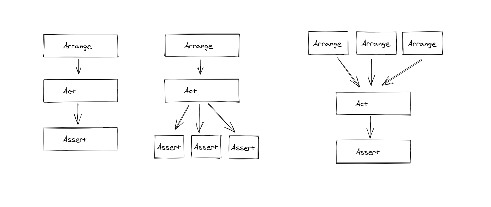

In my [previous post](https://mitesh1612.github.io/hugo-blog/posts/primer-on-tests/), I talked about various kinds of Tests. As a developer working for a mature codebase, the most common tests that you will need to write are Unit Tests, and its a good practice tbh.

While working on my team's project (which was in a fairly early stage), I saw various kinds of Unit Tests and researched a bit myself on how to write some good UTs. Today I plan to share the same in this post. I'll talk about various types of Unit Tests and when you might want to use each.

A quick disclaimer here. Since I work on a C# project, and have the most experience in writing C# (or Python tests), my examples are in C# with NUnit. But language or testing frameworks are subjective and there is no *one size fits all*. My main goal here is to capture these patterns so that you can use them in your own exploits of writing Unit Tests.

## Example Scenario

While this may get refuted later, lets have an example scenario. Consider we have a code for which we want to write a Unit Test. This code takes a User Name and Password, and assuming they are valid, generates an access token for the user and stores it in a cookie. Here is some example code for the same:

```cs
public class SignInUser : ISiteActions
{
    public SignInUser(ICookierHelper cookieHelper, ITokenGenerator tokenGenerator, IDataProvider userDataProvider, IPasswordHasher hasher)
    {
        this.cookieHelper = cookieHelper;
        this.tokenGenerator = tokenGenerator;
        this.userDataProvider = userDataProvider;
        this.passwordHasher = passwordHasher;
    }

    public bool Execute(string username, string password)
    {
        var user = this.userDataProvider.getUser(username);
        if (user == null) return false;
        if(!this.passwordHasher.DoesMatch(password, user.salt, user.hash)) return false;
        var accessToken = this.tokenGenerator.Encode(username, user.userId);
        this.cookieHelper.setCookie(Constants.CookieName, accessToken);
    }
}
```

Again this is just to set some context. These patterns can be easily applied to any kind of code we are testing.

## Arrange-Act-Assert

This is the de-facto, canonical version of the Unit Test. This basically describes the structure of a Unit Test. Unit Tests usually test a single piece of code (say a public class method) and check whether one effect (or output of that method) was correct. Depending upon the complexity of the code being tested, some setup might be necessary, before the code under test can be executed. This pattern of setting up proper conditions for a test, running the code under test and then verifying the result is called **arrange-act-assert** pattern. For example, say we want to test the `Execute` method for the above code with a valid user name but invalid password, here is how we might write it.

```cs
public class SignInUserTests : SiteTestFrameworkBase
{
    [Test]
    public void ShouldFailFor_InvalidPassword()
    {
        // Arrange
        var userSignIn = new SignInUser(GetMock<ICookieHelper>(), GetMock<ITokenGenerator>(), GetMock<IDataProvider>(), GetMock<IPasswordHasher>());
        var username = this.GetValidUserName();
        var password = this.MakePasswordDirty(username);

        // Act
        var result = userSignIn.Execute(username, password);

        // Assert
        Assert.IsFalse(result);
    }
}
```

In this over simplified code, we are using Mock Dependencies to create an instance of the `SignInUser` class. We are also getting a valid username and getting an invalid password for that user. This all setup is part of **Arrange**. After that, we test the method in our **Act** section by passing our inputs and then validate the output in **Assert** section.

This code is an example of a strong Arrange-Act-Assert Pattern. This pattern is great when a specific situation is being tested or a set of specific inputs are tested. It is also great when you want to verify a single thing about the execution of your code.

But what happens when there are multiple side-effects of your code, your code doing multiple things?

## One Act, Many Assertions

Sometimes, while testing some code, the code might have multiple side effects and we might want to make multiple assertions about these multiples effects that the code had. This seems simple, instead of having one assert, we can have multiple asserts in the end of our test. Many people are opposed to this, and while not being a strong problem, it might become a smell in your code.

### Why are multiple assertions a smell?

Consider the case where your test code has multiple assertions in the end. One of the problems with this is that when a test fails, we might need to determine what part of code has failed. In this case, we might need to resort to going through stack traces to find out what actually failed.

Also, in NUnit (and a lot of other testing frameworks) the failure of a single assertion might cause the test execution to stop, so an early failure in this test can mask probable future failures in the test.

There is a solution to this problem, by using a method called *specification testing* or behavior driven development testing. Specification based testing techniques uses the specification of the program as the point of reference for test data selection.

For example, for the above code, we might want to test when a user successfully logs in, that result comes out `true` and the respective cookie is set. Consider the following code:

```cs
public class SignInUserTests : SiteTestFrameworkBase
{
    [SetUp]
    public void SetUp()
    {
        var userSignIn = new SignInUser(GetMock<ICookieHelper>(), GetMock<ITokenGenerator>(), GetMock<IDataProvider>(), GetMock<IPasswordHasher>());
        var username = this.GetValidUserName();
        var password = this.GetValidPassword(username);
        var result = userSignIn.Execute(username, password);
    }

    [Test]
    public void ShouldSucceed() => Assert.IsTrue(result);

    [Test]
    public void ShouldSetCookie() => GetMock<ICookieHelper>().VerifyCalled(x => x.SetCookie(Constants.CookieName, TestConstants.TokenValue));
}
```

Since the above two results can fail indepedently from each other (we might not be able to set the cookie for some reason, for example), so putting both these assertions in the same test doesn't make sense.

This type of test is great when your piece of code has multiple effects that can succeed or fail independently.

## Test Cases

I like to call this pattern, *Multiple Arranges*, to match with the above title, but that's probably wrong. This type of test is useful when we want to test a lot of different inputs matched with a lot of different outputs. Here we can do away with our example since it won't be really helpful for this type of test.

Assume, we wrote an awesome function `ConvertToEmoji` that can convert the text description of an emoji to the actual emoji and we want to validate lots of different inputs and validate their outputs. We could write an *Arrange-Act-Assert* pattern type test for each input but that would have a lot of duplicate code and we want to maintain our test code maintainable.

NUnit has a great feature to write specifically these type of tests that can scale well (stay tuned after the example to know what to do if your test framework doesn't have this feature).

This is how this type of test can be written in NUnit.

```cs
public class EmojiConverterTests
{
    [TestCase("smile", "😀")]
    [TestCase("poop", "💩")]
    [TestCase("cry", "😪")]
    [TestCase("diamond", "💎")]
    [TestCase("ballon", "🎈")]
    [TestCase("thumbs up", "👍")]
    [TestCase("pizza", "🍕")]
    [TestCase("fire", "🔥")]
    public void ConversionTests(string description, string emoji)
    {
        Assert.AreEqual(EmojiConverter.ConvertToEmoji(description), emoji)
    }
}
```

### What if your test library doesn't support this?

Say your framework doesn't support this type of feature, what can you do?

One way is that maybe you can have some sort of collection to store your input-output pairs and then iterate over the collection. It's not quite as slick versus when this is built in the test library but it can still let you remove duplicate code and more importantly, **let you add new tests easily**. Example Code:

```cs
public void ConversionTests()
{
    List<string> inputs = this.GetEmojiInputs();
    List<string> outputs = this.GetEmojiOutputs();
    for(int i = 0;i<inputs.Count;i++)
    {
        Assert.AreEqual(EmojiConverter.ConvertToEmoji(inputs[i]), outputs[i]);
    }
}
```

These type of tests are quite common for conversion of client contracts of an API to your server models or your server models to your database entity models (having separate models is actually quite a good pattern), where in we test with a valid set of inputs and invalid set of inputs (their number usually depends on the complexity of the objects being converted). Sometimes, we might not be able to pass in values of the test cases directly, then we can probably read the objects from a file system as well.

For example:

```cs
public class ClientServerModelsConverterTests
{
    [TestCase("/inputs/valid1", "/outputs/valid1")]
    [TestCase("/inputs/valid2", "/outputs/valid2")]
    public void ConversionTests(string inputPath, string outputPath)
    {
        var inputObject = ReadFromFilePath<ClientObj>(inputPath);
        var outputObject = ReadFromFilePath<ServerObj>(outputPath);

        Assert.IsTrue(ObjectsAreEqual(inputObject.ToServerObject(), outputObject));
    }
}

```

(I know this code might have other issues, like how we can convert two inputs to one, but hey if you are nitpicking into my code, that means you read and understood it and mission accomplished 😎)

This pattern also makes it easy to add new test cases. And using NUnit's pattern we can easily show that we are testing the conversion process, not just the conversion for one specific input. This lets you explain your intent in test cases quite clearly and that is quite helpful.

## What type of test you should use?

As I said, there is *no one size fits all* and each type of unit test is great in its own context. And when in doubt, the standard arrange-act-assert is a great start!

Also, remember that test is code too. Like production code that will be deployed, we should make testing code more maintainable, avoid duplication and scalable to new cases.

I hope this post and [the previous post](https://mitesh1612.github.io/blog/A-Primer-on-Different-Kinds-of-Tests/) gives you some ideas to help your test code be even better that it already is. 😀

Hope you enjoyed this post. If you just discovered my blog, do try reading some other posts from me. You can always connect with me on my socials to discuss or engage in conversations about software development with me.
